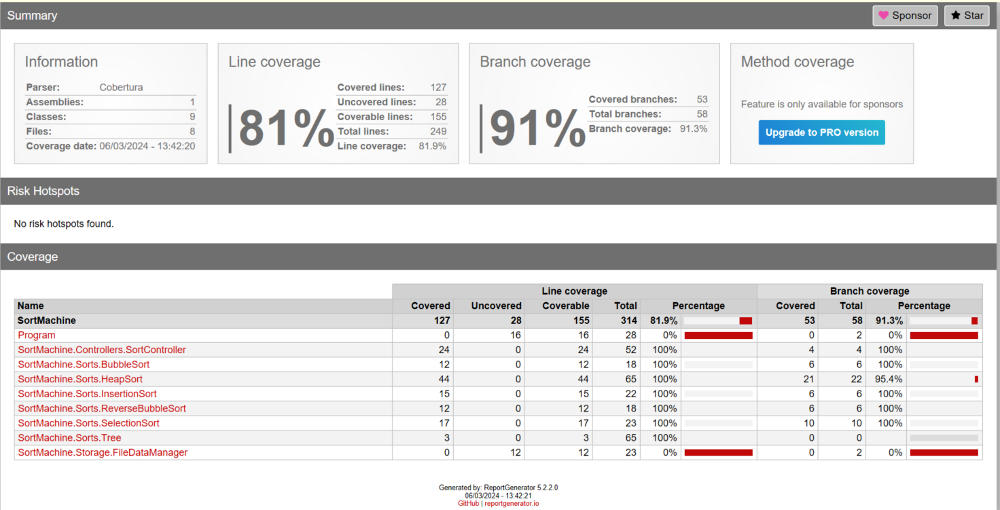
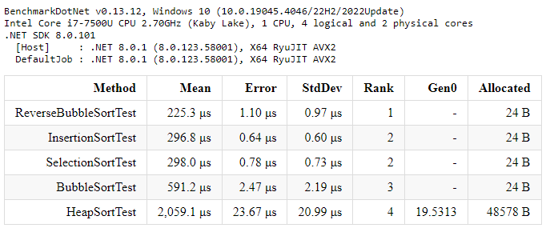

# SortMachine

The project has 5 sort algorithm implementations:

- Bubble sort;
- Reverse Bubble sort;
- Insertion sort;
- Selection sort;
- Heap sort;

## Build and run

This project builds & runs as a regular .net project. Run "SortMachine" by pressing the "Start" button in Visual Studio.

## Tests

This project functionality is covered by xUnit tests. Test coverage is evaluated by using the Coverlet tool.



## Sort algorithms performance comparison.

Sort algorithms were compared by using the Visual Studio BenchmarkDotNet nuget package. To compare algoritms was used array of 1000-length random generated integers (from 0 to 1000).



Performace was compare in reliese mode, because it is moro optimized than debug mode. Used comands:

```
cd .\PerformanceTest
dotnet build -c Release
dotnet .\bin\Release\net8.0\PerformanceTest.dll
```
